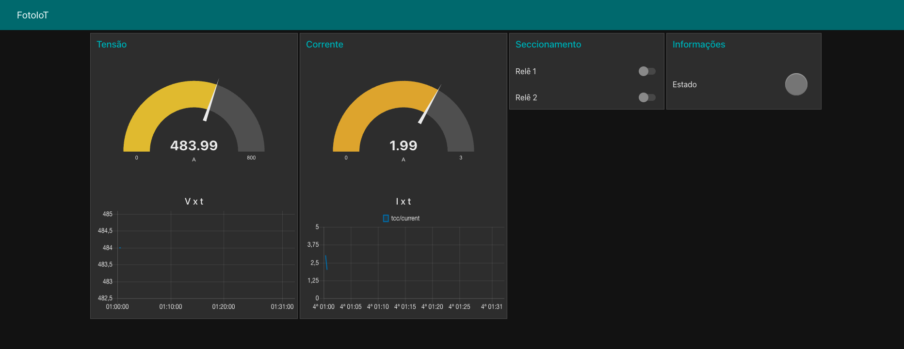

# Comunication Modulo

> The firmware from Tcc Project can perform the below features:
> Controller and send of data to MQTT Broker.

* Send data sensors to MQTT Broker

## Actuators

* Led

## Protocols

* UART
* MQTT

## Comandos ESP-IDF

1. Set enviroments of espressif idf
```sh
cd $HOME
. $HOME/esp/esp-idf/export.sh
```

3. Set develop board and settings configurations
```sh
idf.py set-target esp32
idf.py menuconfig
```

4. Build of project
```sh
idf.py build
```

5. Upload project in develop board
```sh
idf.py -p PORT [-b BAUD] flash
idf.py -p PORT flash monitor
```

6. See screen monitor
```sh
screen /dev/ttyUSB0 115200
```

## Dashboard
